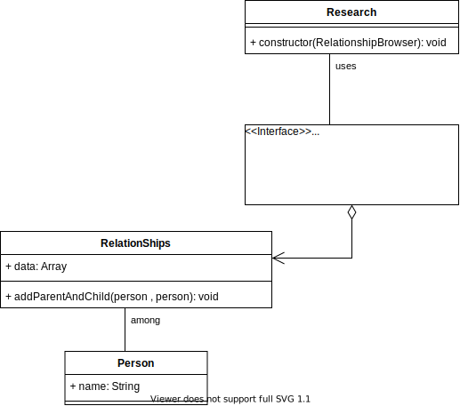

# Definition :
High level modules should not depend on low level modules; both should depend on abstractions.
# Problem statement :
We have some people and we want to set the relationship between them and a way to reasearch these realations 
for simplicity say we have a person called 'john' that has a son called 'chris' we want to record *(low level)* this relation and find a way to research *(high level)* it
# Abstraction : 
1. Make a Person class with name proprity 
2. Make a Relationship class that stores the relation ships between persons
3. Make Research class to search these relation ships.

# Bad Approach :
Ok we will start with the person class 
```js
class Person {
  constructor(name) {
    this.name = name;
  }
}
```
then define some relationships as follow
```js
let Relationship = Object.freeze({
  parent: 0,
  child: 1,
  sibling: 2,
});
```
now let's define the **Relationships** class and this class is considered low level class as it deals with storage, This class will have a method to add relationships called **addParentAndChild**
```js
// Low-Level (Storage)
class Relationships {
  constructor() {
    this.data = [];
  }
  addParentAndChild(parent, child) {
    this.data.push({
      from: parent,
      type: Relationship.parent,
      to: child,
    });
    this.data.push({
      from: child,
      type: Relationship.child,
      to: parent,
    });
  }
}
```
now let's define the Research class and this class is considered a high level class as it does a level operation which is reasearching, This class take a relationship class as a parameter and find and for example and simplicity here we will make it research the children of a person clled **'John'**
```js 
// high-level module (filtering / searching )
class Research {
  constructor(relationships) {
    const rels = relationships.data.filter(
      (r) => r.from.name === 'John' && r.type === Relationship.parent
    );
    for (let r of rels) {
      console.log(`John is parent of ${r.to.name}`);
    }
  }
}
```
Let's test this 
```js
let parent = new Person('John');
let child1 = new Person('Chris');
let child2 = new Person('Matt');

// low-level module
let rels = new Relationships();
rels.addParentAndChild(parent, child1);
rels.addParentAndChild(parent, child2);

new Research(rels);
```
```bash
John is parent of Chris
John is parent of Matt
```
and fair enough it outputs the right output but what if we wanted to restructure out storage way to be in a map or graph or any other data structure, We will have to change not only the implementation of the Relationships class but also the Research class because as you can see we use very specific implementation details in the Research class

# Better Approach :
We make a better design by mainly not making Research class depends on the Relationships class or at least minimize it.
As you read from the definition high level classes (Research) should not depend on low level classes (Relationships) instead it should depend on abstraction.
Unfortunately there is nothing called abstraction in javascript but we will use something to wrap around it.
Abstraction class or interface is simply a class with one or more abstract methods these abstracts methods have no implementation and the classes inherets from this interface or abstract must provide an implementation for these methods.
This diagram shows how classes are connected 



now we will implement the interface we call it 
```js
// abstract/interface class
class RelationshipBrowser {
  constructor() {
      // this is an interface it should not be instantiated
    if (this.constructor.name === 'RelationshipBrowser')
      throw new Error('RelationshipBrowser is abstract!');
  }
  // this is an abstract method
  // and it must be implemented in the child class
  getAllChildren(name) {}
}
```
now we make redefine our Relationships class to inheret from the interface and we add a method to get all the children of a specific parent name
```js
class Relationships extends RelationshipBrowser {
  constructor() {
    super();
    this.data = [];
  }
  addParentAndChild(parent, child) {
    this.data.push({
      from: parent,
      type: Relationship.parent,
      to: child,
    });
    this.data.push({
      from: child,
      type: Relationship.child,
      to: parent,
    });
  }
  getAllChildren(name) {
    const rels = this.data.filter(
      (r) => r.from.name === name && r.type === Relationship.parent
    );
    return rels.map((r) => r.to);
  }
}
```
now we redefine the Research class 
```js 
// high-level module ( searching )
class Research {
  constructor(browser) {
    for (let p of browser.getAllChildren('John')) {
      console.log(`John has a child named ${p.name}`);
    }
  }
}
```
as you can see now the high level class (Research) doesn't any more depend on the low level class (Relationships) instead it depends on the abstraction.
Now if you make a change to the low level module you won't have to change the high level module.