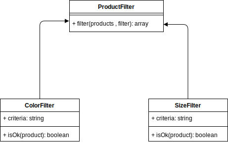
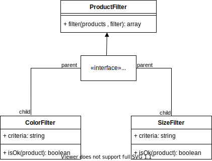

# Definition :
Software entities should be open for extension, but closed for modification.

# Problem statement :
Say we need to make class **Product** which have some proprities of the poduct like its name , color and size. 
We also need to make a **filter** to filter these products by size , color , name or combination of the three.

# Abstraction : 
1. Make a Product class with the dfined proprities
2. Make a Filter to filter the products by a certain criteria

# Bad Approach :
Again an easy problem that you will try to complicate it huh .
First we will make a class Product and assign the needed proprities to it
```js
class Product {
  constructor(name, color, size) {
    this.name = name;
    this.color = color;
    this.size = size;
  }
}
```
now to the filter part, We also make a filter class to filter at first by **color**
```js
class ProductFilter {
  byColor(products, color) {
    return products.filter((p) => p.color === color);
  }
}
```
so far so good now what if after a while of launching this code to the production we wanted to add another filtring criteria such as filtering by size, note that this class was already tested and launched and it's all good.
we will go to the ProducFilter class and **modify** it to add a filter by size method 
```js
class ProductFilter {
  byColor(products, color) {
    return products.filter((p) => product.color === color);
  }
  bySize(products, size) {
    return products.filter((p) => product.size === size);
  }
}
```
again after a while the client wanted to add another filtering criteria which is filtering by both color and size.
``` js
class ProductFilter {
  byColor(products, color) {
    return products.filter((p) => p.color === color);
  }
  bySize(products, size) {
    return products.filter((p) => p.size === size);
  }
  bySizeAndColor(products, size, color)
  {
    return products.filter(p =>
      p.size === size && p.color === color);
  }
}
```
and after a while the client want to add another proprity to the product and filter by it.
I guess you can see where this is going, we contniously modifying an already tested production ready class ,which is not a good thing to do, and now this class is exploded (state space explosion)with methods and each time we want to add another filtering criteria you go and modify and test it again and so on.. 

# Better Approach :
We will create the product class no problem like the previous approach
```js
class Product {
  constructor(name, color, size) {
    this.name = name;
    this.color = color;
    this.size = size;
  }
}
```

Now here's a lil diagram that demonestrate what we will do 




so we make the first filter which is the color filter and it has only one method that checks if an item's color is what we need

```js
class ColorFilter {
  constructor(color) {
    this.criteria = color;
  }
  isOk(item) {
    return item.color === this.criteria;
  }
}
```
Now we make our ProductFilter that will use the color filter 
As you can see it takes the products and the a filter and loop through the products to check if the product is ok with the filter constraints.
```js
class ProductFilter {
  filter(products, xFilter) {
    return products.filter((p) => xFilter.isOk(p));
  }
}
```
to make things lets test this structure we will make some dumb products as you can see and then create a product filter instance.
``` js
let apple = new Product('Apple', 'green', 'small');
let tree = new Product('Tree', 'green', 'large');
let house = new Product('House', 'blue', 'large');

let products = [apple, tree, house];

const pf = new ProductFilter(); 
```
now how to use the color filter 
we make a color filter that filters by the color green 
then use it in our product filter to filter the products
``` js
const filterByGreen  = new ColorFilter('green');
const filteredProducts = pf.filter(products , filterByGreen);
```
now if we console logged our filtered products we get 
```js
for (let p of filteredProducts){
    console.log(`${p.name} is green`)
}
```
```bash
Apple is green
Tree is green
```
now what if we want to add a new filter to filter by size?
we will construct a new class that filters by size as follows
```js 
class SizeFilter {
  constructor(size) {
    this.criteria = size;
  }
  isOk(item) {
    return item.size === this.criteria;
  }
}
```
as you can see we never modified an existing class, instead we **extended** our design to have another class and we never have to modify an already tested production class 
Now let's add another filter to filter by both size and color 
```js
class AndFilter {
  constructor(...filters) {
    this.criterias = filters;
  }
  isOk(item) {
    return this.criterias.every((f) => f.isOk(item));
  }
}
```
can you see how dynamic this is , now if we added as much filtering criteria as we want it's ok this filter will handle it no matter what.

*Note : 
In other programming languages like C++ in a situation like this we use abstract classes and the filters will inheret from it  and the structure will look something like the diagram below but unfortunately JS doesn't have abstract classes*




